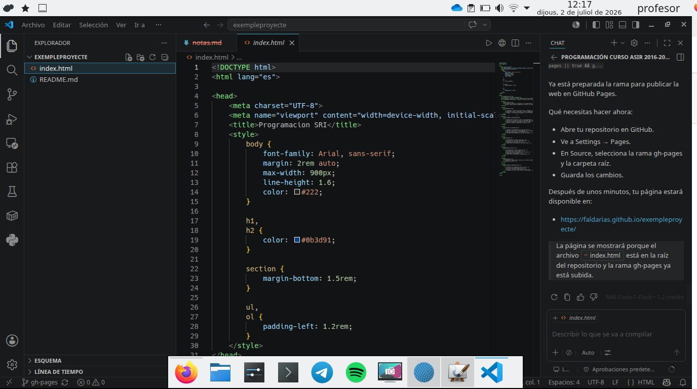
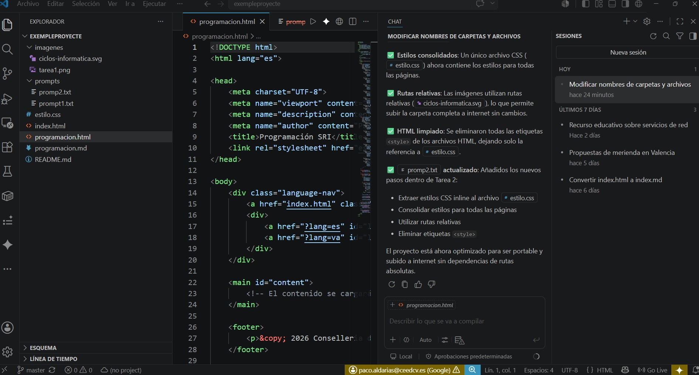
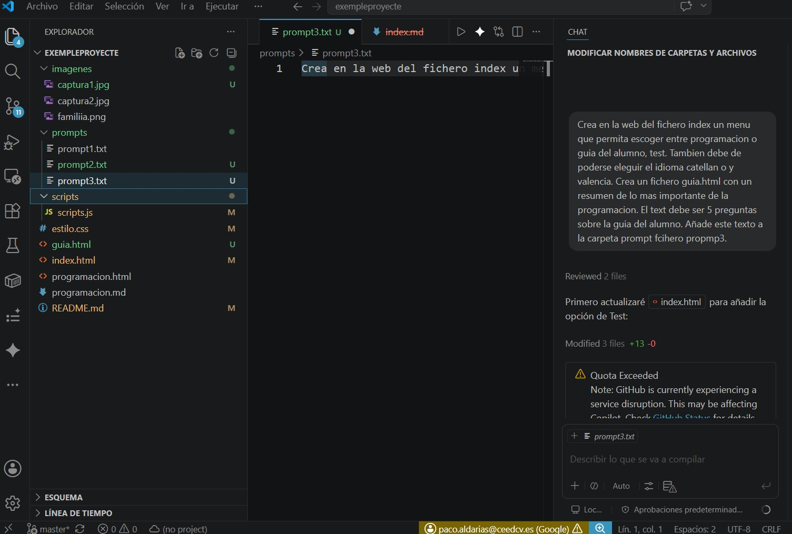
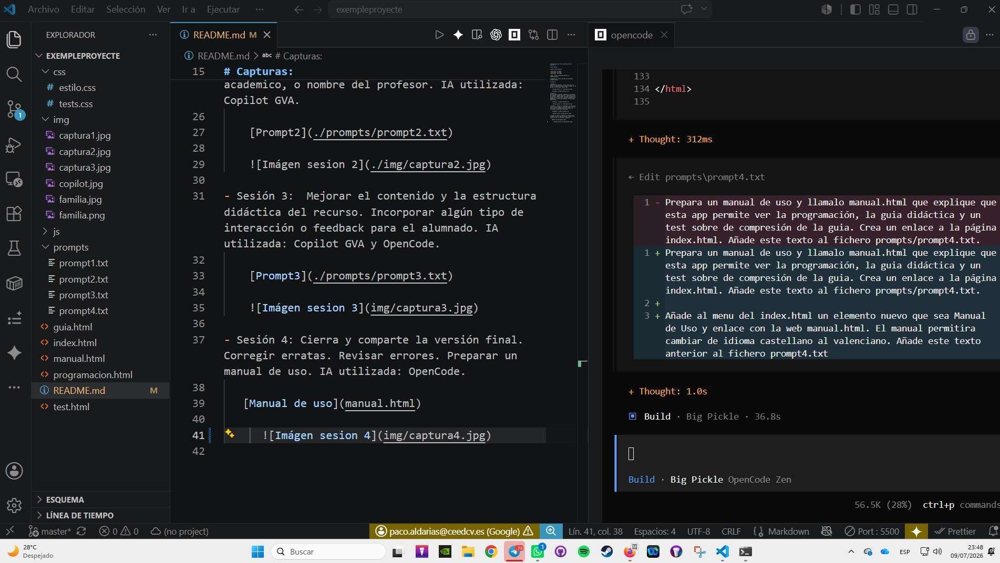

# Repositorio del curso vibecodig de Paco Aldarias. #

# Descripción:

* Autor: Paco Aldarias.

* Revisión1: 2-7-2026
* Revisión2: 9-7-2026
* Revisión3: 10-7-2026
* Revisión3: 11-7-2026

* Web : https://faldarias.github.io/exempleproyecte/

* Repositorio: https://github.com/faldarias/exempleproyecte

# Capturas:

- Sesión 1:
Definición del proyecto. Crear index.html con titulo y elementos básicos. Nivel avanzado url de github. IA utilizada: Copilot GVA.

    

    [Prompt1](./prompts/prompt1.txt)
  
- Sesión 2:
Estructuramos contenido: Separamos el contenido del aspecto creando estilo.css. Definimos estilo de colores. Identificamos secciones sensibles de cambiar para  otros años, como por ejemplo Curso academico, o nombre del profesor. IA utilizada: Copilot GVA.

    [Prompt2](./prompts/prompt2.txt)

    
    
- Sesión 3:  Mejorar el contenido y la estructura didáctica del recurso. Incorporar algún tipo de interacción o feedback para el alumnado. IA utilizada: Copilot GVA y OpenCode.

    [Prompt3](./prompts/prompt3.txt)

    

- Sesión 4: Cierra y comparte la versión final. Corregir erratas. Revisar errores. Preparar un manual de uso. IA utilizada: OpenCode.
  

   [Prompt4](./prompts/prompt4.txt)

   [Manual de uso](manual.html)

    
